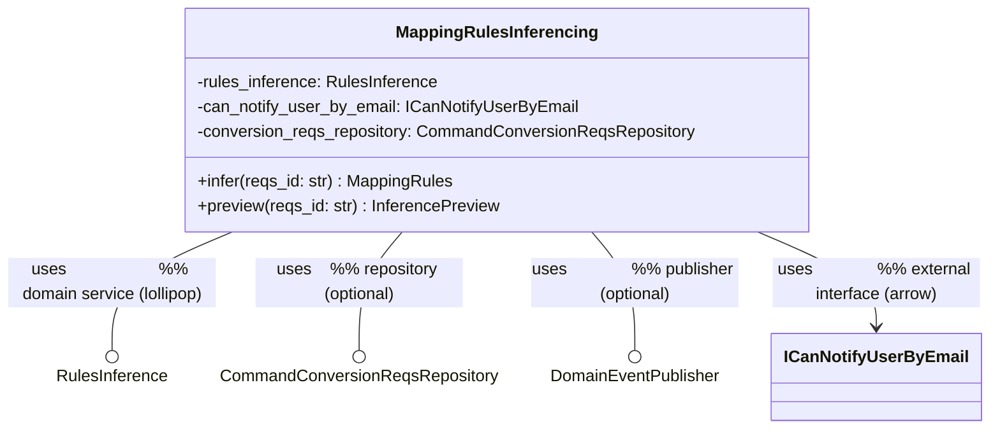

# application-spec — adding orchestration application services (the "ops" track)

**Scope.** Design for extending `plugins/application-spec` to generate a new kind of application service per aggregate — one whose job is to **orchestrate domain-service (`<<Service>>`) invocations** rather than run single-aggregate CRUD. Written 2026-06-05.

**Locked decisions (from interview).**

- **Shape: configurable per method.** Some methods are pure coordinators (call domain services, branch, return a result); others are transactional (also load/save aggregate(s) in a UoW and publish events). The implementer decides per method — exactly the "mutating?" decision `commands-implementer` already makes.
- **Scoping: bound to one aggregate, but many per aggregate.** Each service lives in one aggregate's application package next to `<Aggregate>Commands` / `<Aggregate>Queries`, but an aggregate may declare **several** of them. They are name-discriminated exactly like messaging consumers — one diagram per service.
- **Class name is free-form, no suffix.** The service class is a domain-meaningful noun phrase — e.g. **`MappingRulesInferencing`**, `SubjectTagging`, `InvoiceReconciliation`. No `Ops`/`Service`/`Commands` suffix. "ops" is only the *track / filename* marker (like "messaging" is for dispatchers), **never** part of a class name.

So the track is **"Commands-shaped, pluralized with an `<op-name>` discriminator (like messaging), emitting a free-form class."**

**Files reviewed.**

- Orchestrators: `skills/generate-application`, `generate-specs`, `generate-code`, `init-application`
- Agents: `commands-deps-writer`, `commands-methods-writer`, `commands-implementer`, `services-finder`, `service-implementer`, `application-files-scaffolder`, `target-locations-finder`
- Skills: `commands`, `naming-conventions`, `services-report-template`, `dependency-injection-patterns`, `interfaces`, `fake-implementations`, `retry-transaction`
- Cross-ref: `messaging-spec` (the per-consumer discriminator pattern this borrows)

---

## 1. How the plugin works today (mental model)

Per aggregate, three hand-authored Mermaid diagrams drive everything (`naming-conventions`):

```
<stem>.md            # domain model + <<Service>> ABCs
<stem>.commands.md   # <Aggregate>Commands application service + collaborators
<stem>.queries.md    # <Aggregate>Queries application service + collaborators
```

Two-phase pipeline:

- **`generate-specs`** parses the commands/queries diagrams → `<stem>.application/{commands,queries}.specs.md`, `{commands,queries}.exceptions.md`, `services.md`.
- **`generate-code`** turns specs into Python: scaffold stubs → wire collaborator services → settings/exceptions → implement Commands + Queries → integration tests.

**Only two application-service classes are ever generated**, both aggregate-centric: `<Aggregate>Commands`, `<Aggregate>Queries`.

### The terminology trap that becomes the biggest reuse lever

"Service" in `services-finder` / `service-implementer` does **not** mean a standalone application service. It means a **collaborator** — an external interface (`I…`) or a domain-service `<<Service>>` ABC. `service-implementer` already wires any collaborator end-to-end:

> Protocol interface stub → infrastructure impl → test fake → DI provider → conftest fixtures (`service-implementer.md`).

So **domain-service ABCs are already first-class injectable dependencies.** What's missing is an application service whose *purpose* is to orchestrate them, freed from the aggregate-CRUD template.

### Why the orchestration case can't ride the Commands track

The Commands track is welded to one shape — load one aggregate → call one domain method → save → commit → publish → **return the aggregate**:

| Constraint | Location |
|---|---|
| "every command method returns `<AggregateRoot>`" — hard invariant, aborts otherwise | `commands-methods-writer.md:13-14, 63` |
| requires a primary `Command<Aggregate>Repository` + `AbstractUnitOfWork` | `commands-implementer.md:76, 127` |
| three flow shapes (factory / collaborator-call / canonical) all centered on one aggregate; canonical requires a same-named aggregate method | `commands-methods-writer.md:95-150` |
| service class identified by the `Commands` suffix | `commands-deps-writer.md:46` |
| `commands` template bakes in `_find_<aggregate>` / `save` / `commit` / `_publish_events` around a single aggregate | `skills/commands/SKILL.md` |

Domain services *can* be injected today (the "collaborator-call shape"), but only as helpers that feed **one** aggregate, and the method must still return that aggregate. A real orchestration method — coordinate several `<<Service>>` calls, branch on results, maybe touch several aggregates or none, return a DTO/`None` — breaks the return-aggregate invariant, the single-primary-repo assumption, and the suffix-based identification.

---

## 2. The design — an "ops" track that mirrors Commands

Add a track that is **structurally a clone** of the Commands track but (a) relaxes the aggregate-centric invariants, (b) is **pluralized** (any number per aggregate, name-discriminated like a messaging consumer), and (c) emits a **free-form class** identified structurally rather than by suffix. Everything below the spec layer (collaborator wiring, DI, fakes, exceptions, settings, locations) is reused unchanged. The track is **opt-in per aggregate**, gated on the presence of at least one `<stem>.ops.<op-name>.md` diagram; each such diagram becomes one service.

`<op-name>` is a kebab-case discriminator (`^[a-z][a-z0-9-]*$`), and the contract is **`<op-name>` == kebab-case of the class name** — so the file `…ops.mapping-rules-inferencing.md` declares `class MappingRulesInferencing`. This plays the role `<consumer-name>` plays in messaging-spec, and the kebab↔class equality is validated (see §2.4).

### 2.1 New input diagrams: `<stem>.ops.<op-name>.md` (one per service)

Each service is one hand-authored diagram, top-level sibling of the others. Example for aggregate `conversion-reqs` with two services:

```
conversion-reqs.md
conversion-reqs.commands.md
conversion-reqs.queries.md
conversion-reqs.ops.mapping-rules-inferencing.md   # → class MappingRulesInferencing
conversion-reqs.ops.evo-version-sync.md            # → class EvoVersionSync
```

Each diagram uses the **same link grammar** the commands classifier already parses (so the classifier is shared verbatim):



**Input contract** (differences from `<stem>.commands.md`):

- **Exactly one class with a body.** The service is identified as the unique `class <X> { ... }` brace block in the diagram — there is no `Commands`/`Ops` suffix to match. All collaborators appear as **link endpoints only** (declared with their members in the domain/commands/queries diagrams). Zero or two-plus brace blocks → abort. `<X>` is the Python class name, used verbatim. Cross-check: `<X>` must be the source of the `uses` links.
- **Name-discriminated, many per aggregate.** The filename carries `<op-name>`; validate `kebab-case(<X>) == <op-name>` (the no-suffix analogue of the commands "both specs yield the same `<AggregateRoot>`" check). `<X>` need not relate to `<Aggregate>` — the aggregate binding comes from `<stem>`.
- **Free return types.** `infer(...) MappingRules`, `preview(...) InferencePreview` — no return-aggregate invariant.
- **Repository optional.** A pure coordinator may declare zero repositories.
- **Domain services are the headline**, not incidental helpers.

### 2.2 New sibling artifacts (`naming-conventions` gets new rows) — one set per `<op-name>`

```
<stem>.application/
  ops.<op-name>.specs.md       # merged: deps + methods + exceptions
  ops.<op-name>.exceptions.md  # application exceptions raised by this service's methods
  ops.<op-name>.deps.md        # transient — deleted by merger
  ops.<op-name>.methods.md     # transient — deleted by merger
```

e.g. `ops.mapping-rules-inferencing.specs.md`. The `<op-name>` discriminator embeds in the filename exactly like `commands`/`queries` embed their role — every artifact stays flat inside the one `<stem>.application/` folder (no sub-folder), consistent with the existing convention.

Each `ops.<op-name>.specs.md` reuses the **exact** section structure of `commands.specs.md` (`## Dependencies` with `### Repositories / Domain Services / External Interfaces / Message Publishers`, then `## Method Specifications` with `### Method:` blocks; top-level heading `# <X>` — verbatim class name, nothing stripped), so the implementer's spec-parsing is shared.

**`naming-conventions` deltas:**

- Diagram filenames table → add `| Ops application service | `<dir>/<stem>.ops.<op-name>.md` | hand-authored input |`.
- `<stem>.application/` file table → add the four `ops.<op-name>.*` rows above.
- Path-resolution recovery table → add `<ops_diagram>` = `<dir>/<stem>.ops.<op-name>.md`: split the basename on the literal `.ops.` (both `<stem>` and `<op-name>` are dot-free kebab, so the split is unambiguous) — left part is `<stem>`, right part minus `.md` is `<op-name>`.

### 2.3 New `ops` template skill (sibling to `commands`)

A generic orchestration template. The per-method fork is the whole point; `{{ service_class }}` is the verbatim diagram class name (no suffix):

```python
import logging
# pubsub imports only if any method publishes
# UoW import only if any method persists
from {{ domain_module }} import {{ aggregate_name }}, {{ aggregate_not_found }}
from {{ retry_module }} import retry_on_transaction_error

from {{ iface.module }} import {{ iface.name }}


__all__ = ["{{ service_class }}"]


class {{ service_class }}:                       # e.g. MappingRulesInferencing
    def __init__(
        self,
        unit_of_work: AbstractUnitOfWork,
        {{ p.attr }}: {{ p.name }},
        {{ s.attr }}: {{ s.name }},
        {{ e.attr }}: {{ e.name }},
    ) -> None:
        self._uow = unit_of_work
        # self._<attr> = <attr> for every collaborator ...
        self._logger = logging.getLogger(self.__class__.__name__)

    # --- transactional method (flow persists) ---
    @retry_on_transaction_error()
    def {{ method }}(self, ...) -> {{ free_return_type }}:
        with self._uow:
            # orchestration body: service calls, branching, load/mutate/save
            self._uow.commit()
        # optional self._publish_events(...)
        self._logger.info(...)
        return {{ result }}            # only if return type is non-None

    # --- pure coordinator (flow does not persist) ---
    def {{ method }}(self, ...) -> {{ free_return_type }}:
        # orchestration body: service calls, branching
        return {{ result }}            # only if return type is non-None
```

### 2.4 Per-agent deltas

Every ops agent takes a `<op-name>` arg (plus the usual diagram / locations / tests args), exactly as messaging agents take `<consumer_name>`. It derives `<stem>`/`<dir>` from the domain diagram, reads `<stem>.ops.<op-name>.md` + the `ops.<op-name>.*` siblings, binds `<service_class>` = the unique braced class, and `<op_snake>` = snake_case(`<op-name>`) = snake_case(`<service_class>`). Module, DI key, fixture, and test names all derive from `<op_snake>` — so there is **no "ops" token in any generated Python identifier.**

| New agent | Cloned from | Changes |
|---|---|---|
| `ops-deps-writer` | `commands-deps-writer` | Take `<domain_diagram> <op-name>`; parse `<stem>.ops.<op-name>.md`; write `ops.<op-name>.deps.md`. **Identify the service as the unique braced class** (drop the `Commands`-suffix rule, `:46`). Reuse Steps 4-7 verbatim (member type→attr map, link classification, UoW-attr derivation). Relax the final abort: do **not** fail when `### Repositories` is empty (pure coordinators are valid). Domain Services is the headline category. |
| `ops-methods-writer` | `commands-methods-writer` | Take `<domain_diagram> <op-name>`; write `ops.<op-name>.{methods,exceptions}.md`. Identify the service by braced class; **validate `kebab-case(<X>) == <op-name>`**. **Drop** the return-aggregate invariant (`:63`); capture each declared return type verbatim. Replace the three aggregate flow shapes with one **orchestration flow shape** authored primarily from per-method description prose (see §3). Keep Purpose / Postconditions / Raises / exception-extraction mechanics. `Requires Aggregate State` becomes optional (emit only when a method touches the aggregate). Heading emitted as `# <X>`. |
| `ops-implementer` | `commands-implementer` | Take `<domain_diagram> <locations_report_text> <op-name>`; parse `ops.<op-name>.specs.md` (heading `# <X>` → class name verbatim, no stripping); stub `<op_snake>.py` → `class <X>`. Reuse Steps 3-4 (import resolution) and Step 6 (read aggregate/repo/exception APIs) verbatim. Per method, reuse the **mutating decision** (`:324-333`) to gate `with self._uow:` + `@retry` + `commit` + publish. Allow `return <expr>` from the flow's final "Return …" step instead of always returning the aggregate; allow methods with no repo at all. DI wiring (Steps 9-10) + conftest fixture (Step 11) identical, keyed on `<op_snake>`. |
| `ops-tests-implementer` | `commands-tests-implementer` | Take `<domain_diagram> <tests_dir> <op-name>`; write `test_<op_snake>.py`. |

Because the discriminator scopes every artifact and every DI/fixture key, multiple services for the same aggregate never collide — the fan-out is embarrassingly parallel (like messaging's per-consumer runs and the commands/queries split within an aggregate).

### 2.5 Glue (small edits to existing agents/orchestrators)

- **`application-files-scaffolder`** — discover every `ops.*.specs.md` in `<stem>.application/`; for each, emit a `<op_snake>.py` stub (`__all__ = ["<X>"]` / `class <X>: pass`) and add it to the aggregate `__init__.py` aggregator; fold each service's Domain Services + External Interfaces into `<service_packages>` / `<application_interfaces>` so the **existing** `service-implementer` wires them with zero new code.
- **`services-finder`** — also scan every `ops.*.specs.md`'s `## Dependencies`; collaborators used only by an ops service land in `services.md` with `<X>` added to their `Consumers`. Existing `service-implementer` then stubs/fakes/DI-wires them unchanged. (The `Consumers` field becomes "any application-service class," not just `*Commands`/`*Queries` — a one-line semantic widening.)
- **`specs-merger`** — handle a third `ops` side keyed by `<op-name>`: read `ops.<op-name>.{deps,methods,exceptions}.md`, write `ops.<op-name>.specs.md` with top heading `# <X>`, then delete the fragments. Unlike commands/queries the heading is **not** suffix-derived — the merger reads `<X>` from the unique braced class in `<stem>.ops.<op-name>.md`. Invoked as `<domain_diagram> ops <op-name>`.
- **`application-exceptions-specifier`** — also enrich every `ops.<op-name>.exceptions.md` stub (the same stub → full-class-spec pass it already runs for commands/queries), so ops-raised application exceptions get full specs before the merger folds them in.
- **`exceptions-implementer`** (generate-code) — also read every `ops.<op-name>.exceptions.md` so ops-raised application exceptions get implemented on the aggregate's `exceptions.py` alongside the commands/queries ones.
- **`generate-specs`** — glob `<stem>.ops.*.md`. For each match: add `ops-deps-writer` + `ops-methods-writer` to the Step-1 parallel fan-out (grows by 2×N); have the exceptions-specifier cover its `ops.<op-name>.exceptions.md`; and add one `specs-merger` run with `<domain_diagram> ops <op-name>` to Step 3.
- **`generate-code`** — for each `ops.*.specs.md`, run `ops-implementer` after Step 6 and `ops-tests-implementer` in Step 7 (parallel across services).
- **Optional per-service skills** mirroring messaging (`generate-ops <domain_diagram> <op-name>`) if you want to (re)generate a single service without the whole aggregate. Not required — the umbrella auto-discovers.

### 2.6 Reuse map

| Reused unchanged | New |
|---|---|
| `target-locations-finder`, `service-implementer`, `interfaces`, `fake-implementations`, `fake-override-fixtures`, `dependency-injection-patterns`, `retry-transaction`, `commands-dependencies-template`, `settings` | **New files:** `<stem>.ops.<op-name>.md` diagram kind; `ops` template skill; `ops-deps-writer`; `ops-methods-writer`; `ops-implementer`; `ops-tests-implementer`. **Edited files:** `application-files-scaffolder`, `services-finder`, `specs-merger`, `application-exceptions-specifier`, `exceptions-implementer`, `generate-specs`, `generate-code`, `naming-conventions`, `plugin.json` |

\* `services-finder`, `specs-merger`, `naming-conventions` need additive edits (an extra discriminator / rows / a widened Consumers notion), not rewrites.

---

## 3. Main design risk: orchestration flows can't be inferred from diagram structure

Commands flows are *mechanical* (load → mutate → save is a fixed skeleton, so `commands-methods-writer` synthesizes them from the diagram alone). Orchestration flows are *business logic* — "infer the rules; if the model is confident, attach them to the aggregate; else notify the owner for manual review" cannot be derived from class signatures.

**Mitigation.** Make `ops-methods-writer` treat the **per-method labelled description prose as the authoritative source** for the `**Method Flow**`, and use the diagram only to ground identifiers (which `self._<attr>.<op>(...)` calls exist, what the aggregate's methods are). This mirrors how rest-api / messaging specs lean on input tables — here the "input table" is the prose block per method, authored alongside the diagram:

```markdown
### infer(reqs_id: str) -> MappingRules

1. Load the `ConversionReqs` via `CommandConversionReqsRepository.reqs_of_id(reqs_id)`; if `None`, raise `ConversionReqsNotFound`.
2. Invoke `RulesInference.infer(reqs.evo_version, reqs.domain_types)` to obtain `inference`.
3. If `inference.is_confident`, call `reqs.apply_mapping_rules(inference.rules)` and persist via `CommandConversionReqsRepository.save(reqs)`.
4. Else call `ICanNotifyUserByEmail.notify(reqs.owner_id, "manual review needed")`.
5. Publish events via `DomainEventPublisher`.
6. Return the inferred `MappingRules`.
```

The implementer's flow translator (`commands-implementer.md:362-401`) is *already* generic enough for steps 1-5 (service calls, branching, load+raise, save, publish) — the only genuinely new emission is step 6's free `return`. So most of the implementer's value transfers directly; what shrinks is the diagram-only inference in the *methods-writer*, replaced by prose-faithful transcription.

---

## 4. Suggested build order

1. `naming-conventions` rows + `ops` template skill (pure docs, no behavior).
2. `ops-deps-writer` + `ops-methods-writer` + `specs-merger`/`application-exceptions-specifier` edits (+ wire into `generate-specs`, gated on diagram glob). Validate specs on a real `<stem>.ops.<op-name>.md` before touching code-gen.
3. `application-files-scaffolder` + `services-finder` edits (so collaborators get wired by the existing machinery).
4. `ops-implementer` + `exceptions-implementer` edit (+ wire into `generate-code`).
5. `ops-tests-implementer`.
6. Bump `application-spec` `plugin.json` version.

Phase 2 alone (specs only) is independently useful and low-risk — it produces a reviewable `ops.<op-name>.specs.md` without changing any generated code path.

---

## 5. Open questions

- **op-name ↔ class sync.** Hard-validate `kebab(<X>) == <op-name>` (recommended — prevents a file/class drift bug), or allow them to diverge and derive the module purely from `<op-name>`? Leaning hard-validate, since the no-suffix design already removed one safety rail.
- **Return DTOs.** Where do orchestration result types (`MappingRules`, `InferencePreview`) live and who specs them — a domain TypedDict / value object already in `<stem>.md`, or a new declared shape? Likely reuse the domain-spec TypedDict / query-DTO machinery; the methods-writer should require the return type to resolve to a known domain class so the implementer can import it.
- **Cross-aggregate persistence.** Aggregate-bound scoping says "one aggregate," but an orchestration method may legitimately read a *sibling* aggregate's repo (already supported by `commands-implementer`'s non-primary repo handling, `:228-232`). Confirm whether that stays in-scope for the bound variant.
- **Idempotence of the umbrella.** `generate-application` (and `generate-specs`/`generate-code`) must stay a no-op for aggregates with zero `<stem>.ops.*.md` diagrams.
- **`services.md` Consumers vocabulary.** Widening Consumers to arbitrary class names is trivial, but downstream readers that assume the `Commands`/`Queries` suffix (if any) should be audited.
