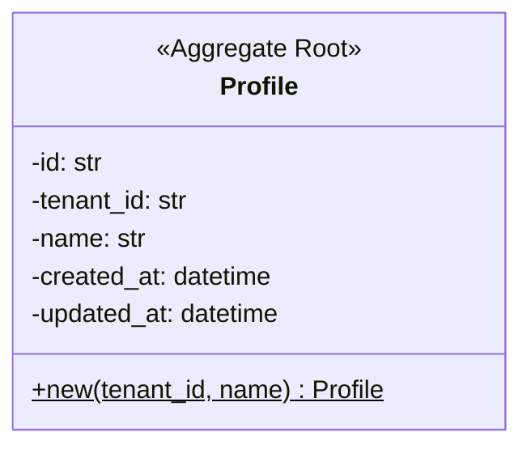
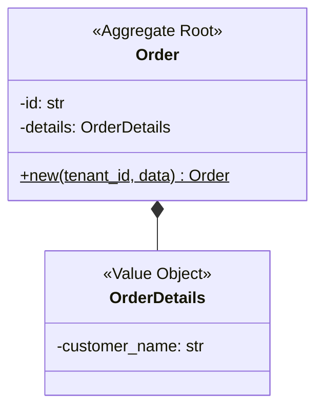
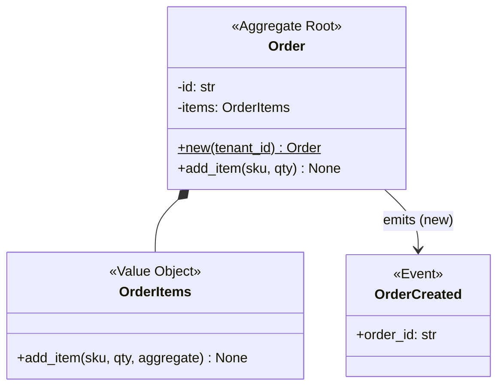
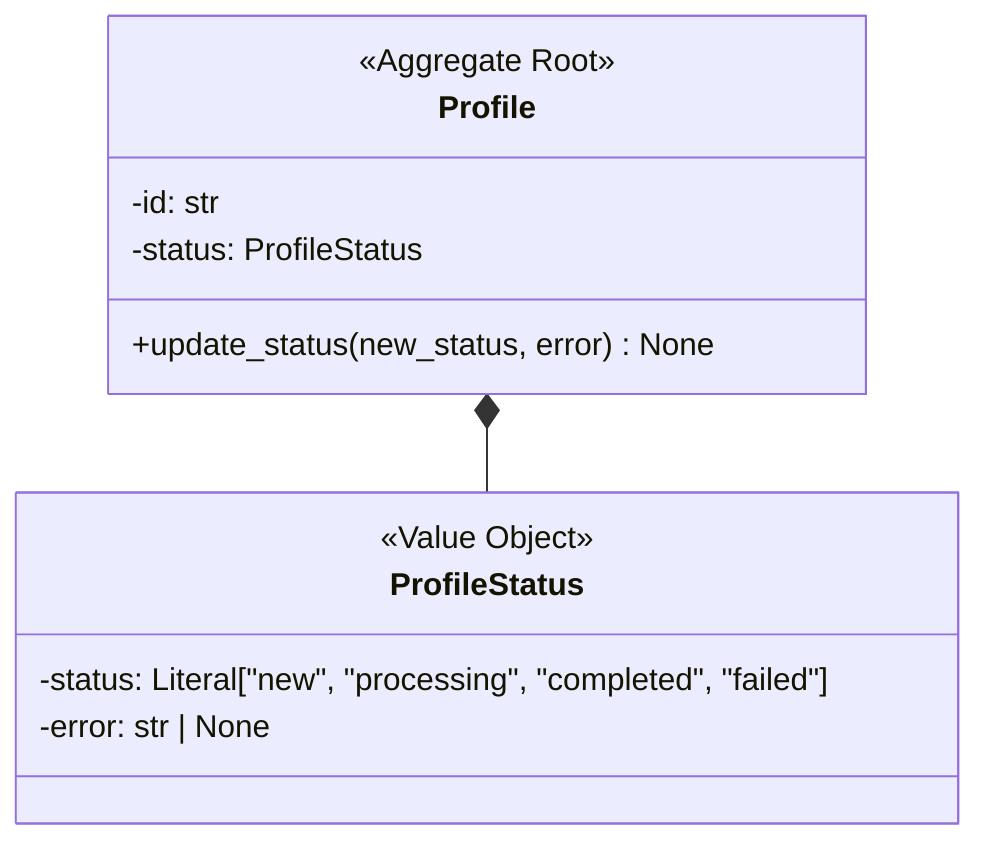
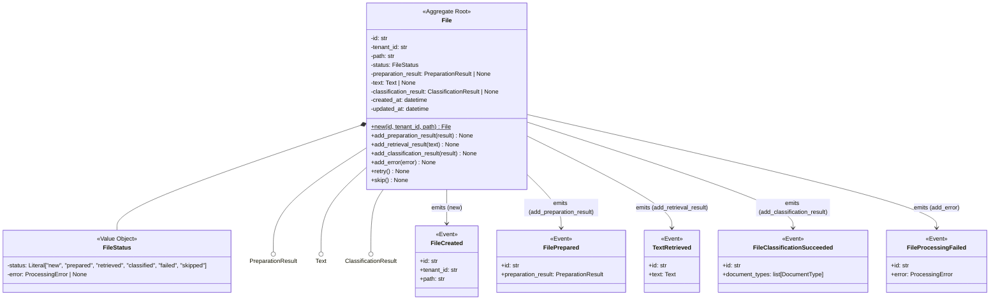
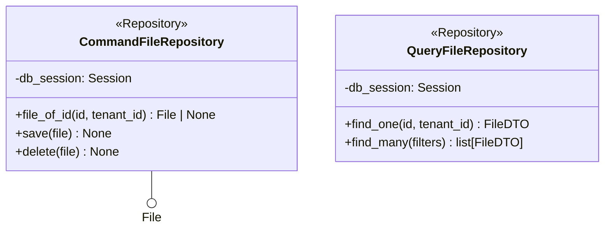
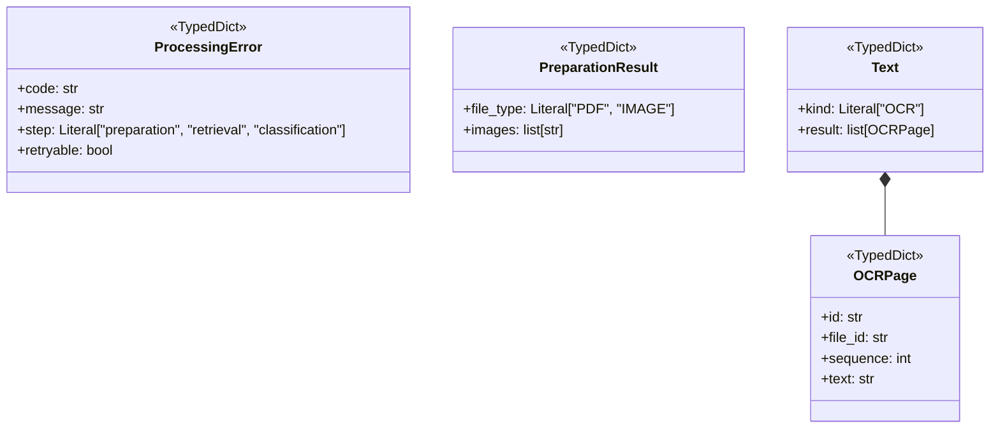
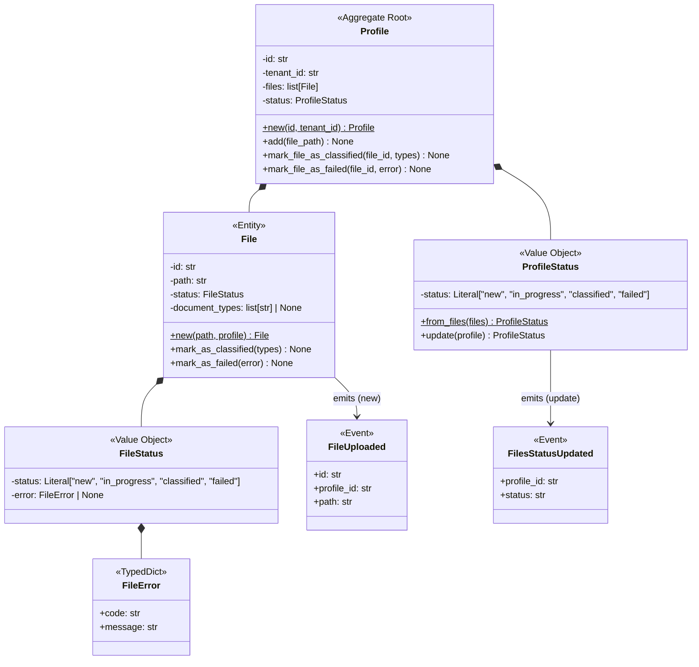
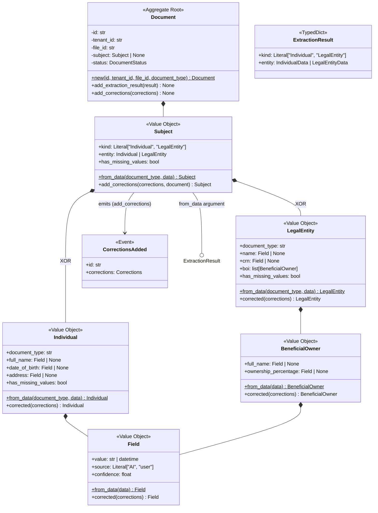

# Pattern Selection Examples

## Example 1: Simple Aggregate

**Pattern List:**
- `domain-spec:aggregate-root`
- `domain-spec:guards-and-checks` + `domain-spec:constructor-guard-type-mapping`

**Reason:** Stereotype + factory method + timestamps. Guards are fundamental for all aggregates.

---

## Example 2: Aggregate with Value Object

**Pattern List for Order:**
- `domain-spec:aggregate-root`
- `domain-spec:guards-and-checks` + `domain-spec:constructor-guard-type-mapping`
- `domain-spec:flat-constructor-arguments`

**Pattern List for OrderDetails:**
- `domain-spec:value-object`
- `domain-spec:guards-and-checks` + `domain-spec:constructor-guard-type-mapping`

**Note:**
- Order needs Flat Constructor if OrderDetails has multiple fields
- Order doesn't need Value Objects pattern -- OrderDetails does
- Both need Guards & Checks

---

## Example 3: Aggregate with Collection and Events

**Pattern List for Order:**
- `domain-spec:aggregate-root`
- `domain-spec:guards-and-checks` + `domain-spec:constructor-guard-type-mapping`

**Pattern List for OrderItems:**
- `domain-spec:value-object`
- `domain-spec:collection-value-objects`
- `domain-spec:delegation-and-event-propagation`
- `domain-spec:guards-and-checks` + `domain-spec:constructor-guard-type-mapping`

**Pattern List for OrderCreated:**
- `domain-spec:domain-events`

**Note:**
- Order emits events, but Aggregate Root pattern already covers event management
- OrderItems is a Value Object that also follows Collection Value Objects pattern
- OrderItems needs Delegation pattern because it delegates events to Order

---

## Example 4: Aggregate with Status

**Pattern List for Profile:**
- `domain-spec:aggregate-root`
- `domain-spec:flat-constructor-arguments`
- `domain-spec:guards-and-checks` + `domain-spec:constructor-guard-type-mapping`

**Why Flat Constructor:** Profile's `__init__` will accept `status: str, error: str | None` (flat args) and internally construct `ProfileStatus(status, error)`.

**Pattern List for ProfileStatus:**
- `domain-spec:value-object`
- `domain-spec:statuses`
- `domain-spec:optional-values`
- `domain-spec:guards-and-checks` + `domain-spec:constructor-guard-type-mapping`

**Why Optional Values:** ProfileStatus has `error: str | None` -- needs guidance on conditional assignment.

**Note:**
- When a value object has multiple fields (status + error), the owning aggregate uses Flat Constructor pattern
- Class names ending in "Status" indicate the Statuses pattern (factory methods like `completed()`, `failed(error)` and boolean properties like `is_completed`, `is_failed`)

---

## Example 5: Complex Aggregate with Multiple Optional Attributes

**Pattern List for File:**
- `domain-spec:aggregate-root`
- `domain-spec:flat-constructor-arguments`
- `domain-spec:optional-values`
- `domain-spec:guards-and-checks` + `domain-spec:constructor-guard-type-mapping`

**Why these patterns:**
- **Flat Constructor:** FileStatus has multiple fields (status + error)
- **Optional Values:** Has 3 optional complex attributes (preparation_result, text, classification_result)
- **Aggregate Root already covers:** Event emission pattern for all 5+ events

**Pattern List for FileStatus:**
- `domain-spec:value-object`
- `domain-spec:statuses`
- `domain-spec:optional-values`
- `domain-spec:guards-and-checks` + `domain-spec:constructor-guard-type-mapping`

**Pattern List for All Events:**
- `domain-spec:domain-events`

**Pattern List for PreparationResult, Text, ClassificationResult:**
- `domain-spec:domain-typed-dicts`

---

## Example 6: Repository

**Pattern List for CommandFileRepository:**
- `domain-spec:repositories` -- Command variant

**Pattern List for QueryFileRepository:**
- `domain-spec:repositories` -- Query variant

**Note:**
- Command repositories work with domain aggregates (File)
- Query repositories return DTOs for read operations
- Naming convention: `Command{Aggregate}Repository` or `Query{Aggregate}Repository`

---

## Example 7: TypedDict for External Data

**Pattern List for All TypedDict classes:**
- `domain-spec:domain-typed-dicts`

**When to use TypedDict:**
- External API responses or requests
- Data transfer objects within domain
- Structured data that domain references but doesn't own
- Nested data structures (Text contains list of OCRPage)

**Note:**
- TypedDicts are not domain objects -- they're structured data definitions
- No Guards & Checks needed (TypedDict provides type validation)
- Can be nested (Text contains OCRPage list)

---

## Example 8: Aggregate with Child Entities

**Pattern List for Profile:**
- `domain-spec:aggregate-root`
- `domain-spec:flat-constructor-arguments`
- `domain-spec:guards-and-checks` + `domain-spec:constructor-guard-type-mapping`

**Pattern List for File (Entity, not Aggregate Root):**
- `domain-spec:entity`
- `domain-spec:flat-constructor-arguments`
- `domain-spec:optional-values`
- `domain-spec:guards-and-checks` + `domain-spec:constructor-guard-type-mapping`

**Pattern List for ProfileStatus:**
- `domain-spec:value-object`
- `domain-spec:statuses`
- `domain-spec:delegation-and-event-propagation`
- `domain-spec:guards-and-checks` + `domain-spec:constructor-guard-type-mapping`

**Pattern List for FileStatus:**
- `domain-spec:value-object`
- `domain-spec:statuses`
- `domain-spec:optional-values`
- `domain-spec:guards-and-checks` + `domain-spec:constructor-guard-type-mapping`

**Pattern List for FileError:**
- `domain-spec:domain-typed-dicts`

**Pattern List for Events:**
- `domain-spec:domain-events`

**Key Insights:**
- **Entities vs Value Objects:** File is an Entity (has identity, owned by Profile), not a Value Object
- **Entity Pattern:** File needs Entity pattern -- it's a child entity within Profile aggregate boundary
- **Delegation Pattern:** ProfileStatus accepts `profile: Profile` parameter and emits events -- needs Delegation pattern
- **Factory with Aggregate:** ProfileStatus has `from_files()` factory and `update(profile)` method
- **Entity Constructor:** File's `new()` accepts `profile: Profile` parameter to establish relationship
- **list[Entity] is NOT Collection Value Object:** Profile has `list[File]` but File is Entity, not Value Object

---

## Example 9: Nested Value Objects with Union Types and Event Delegation

**Pattern List for Document:**
- `domain-spec:aggregate-root`
- `domain-spec:flat-constructor-arguments`
- `domain-spec:optional-values`
- `domain-spec:guards-and-checks` + `domain-spec:constructor-guard-type-mapping`

**Why:** Flat Constructor for DocumentStatus, Optional Values for optional Subject attribute.

**Pattern List for Subject:**
- `domain-spec:value-object`
- `domain-spec:optional-values`
- `domain-spec:delegation-and-event-propagation`
- `domain-spec:guards-and-checks` + `domain-spec:constructor-guard-type-mapping`

**Pattern List for Individual & LegalEntity:**
- `domain-spec:value-object`
- `domain-spec:optional-values`
- `domain-spec:guards-and-checks` + `domain-spec:constructor-guard-type-mapping`

**Pattern List for BeneficialOwner:**
- `domain-spec:value-object`
- `domain-spec:optional-values`
- `domain-spec:guards-and-checks` + `domain-spec:constructor-guard-type-mapping`

**Pattern List for Field:**
- `domain-spec:value-object`
- `domain-spec:optional-values`
- `domain-spec:guards-and-checks` + `domain-spec:constructor-guard-type-mapping`

**Pattern List for ExtractionResult:**
- `domain-spec:domain-typed-dicts`

**Pattern List for CorrectionsAdded:**
- `domain-spec:domain-events`

**Key Insights:**
- **Deeply Nested Value Objects:** Field -> BeneficialOwner -> LegalEntity -> Subject -> Document (4-5 levels deep)
- **Union Type Handling:** Subject.entity is `Individual | LegalEntity` (XOR relationship) -- needs Optional Values for union type handling
- **Value Object Event Delegation:** Subject emits CorrectionsAdded event and accepts `document: Document` parameter -- needs Delegation pattern
- **Computed Properties:** `has_missing_values` is computed from nested Field values
- **Immutable Mutations:** `corrected()` methods return NEW instances (Value Object immutability)
- **Transformation Chains:** Factory methods chain data: TypedDict -> Field -> Individual/LegalEntity -> Subject
- **list[ValueObject] without Collection Pattern:** LegalEntity has `list[BeneficialOwner]` but doesn't need Collection Value Objects (no add/remove lifecycle methods)
- **Value Objects can delegate to Aggregates:** Subject's `add_corrections(corrections, document)` takes aggregate parameter for event delegation
- All value objects need Optional Values due to pervasive optional Field attributes
