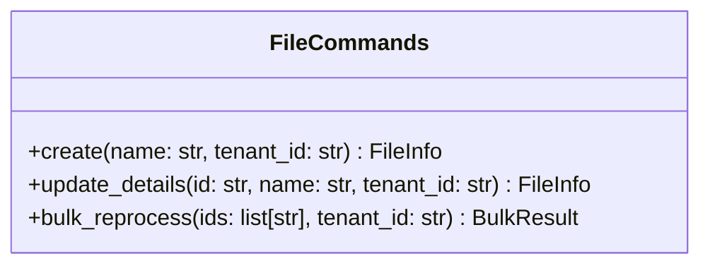
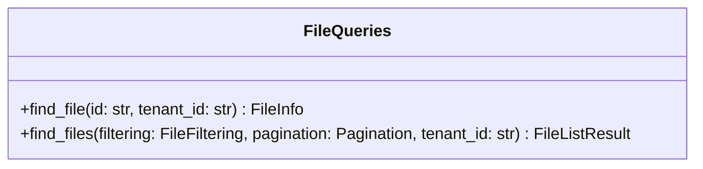

# Surface Markers

## Purpose

A single REST API resource may expose its methods through more than one URL surface — for example, a public `v1` API and an `internal` service-to-service API. Both surfaces share the same `<Resource>Commands` / `<Resource>Queries` application-service class, so the diagram needs an in-line way to declare which surface each method belongs to.

Surface markers are Mermaid line comments inside the class body that act as group delimiters. Every method declared after a marker, up to the next marker (or the closing `}`), belongs to that surface. The set of surfaces discovered across the commands and queries diagrams drives the per-surface section layout of the resource spec (`## Surface: <name>`).

## Marker syntax

A surface marker is a Mermaid line comment that matches exactly:

```
^\s*%%\s+([A-Za-z][A-Za-z0-9_-]*)\s*$
```

The captured name is normalized to **lowercase** as the canonical surface name.

Examples that match:

| Line | Surface name |
| --- | --- |
| `%% v1` | `v1` |
| `  %%   internal  ` | `internal` |
| `%% admin-v2` | `admin-v2` |
| `%% V1` | `v1` |

Examples that do **not** match (treated as regular comments and ignored — they are stripped during Mermaid parsing):

- `%%v1` — no whitespace between `%%` and the name
- `%% v1 (public)` — extra text after the name
- `%% TODO: rename this method` — extra words
- `%% surface: v1` — name token is `surface:`, which fails the `[A-Za-z][A-Za-z0-9_-]*` shape

The strict regex prevents stray comments from accidentally creating phantom surfaces. If the user wants a surface called `v1`, the line must be exactly `%% v1` (with optional surrounding whitespace).

## Scoping

Markers are scoped **per class body**:

- Only markers that appear *inside* a `class <Name> { ... }` block apply.
- A marker outside a class body (between `classDiagram` and the first class block, or in the diagram preamble) is treated as a regular comment and ignored.
- Each class body starts with the **default surface** as its current surface. The first matching marker line replaces it; subsequent matching marker lines replace it again; and so on until the closing `}`.
- Multiple classes in the same diagram each carry their own current-surface state.

## Default surface

If a class body contains methods declared **before** any marker, or contains no markers at all, those methods belong to the surface named **`v1`** (lowercase, no prefix). This makes pre-existing diagrams without surface markers continue to generate valid single-surface specs.

`v1` is also the surface name written into Table 1 of a freshly initialized resource spec. The `endpoint-tables-writer` updates Table 1's Surfaces row when it discovers additional surfaces in the diagrams.

## Method-to-surface mapping

After parsing, each public method declaration is associated with exactly one surface name. Methods can be duplicated across surfaces by declaring them more than once under different markers — the parser does not deduplicate. Consumers (writer agents) then emit one row per `(surface, method)` pair.

Ordering of methods within a surface is the order of declaration in the class body.

## Surface set and ordering

The **surface set** for a resource is the union of surface names discovered across the commands diagram and the queries diagram. A surface that appears in only one of the two diagrams is still part of the set; it just has zero methods on the other side.

Render surfaces in this canonical order everywhere — the `Surfaces` row in Table 1, the sequence of `## Surface: <name>` sections, and any per-surface report counts:

1. **Versioned surfaces first**, sorted by numeric version. A surface name matches the versioned pattern when it equals `^v(\d+)$` (e.g., `v1`, `v2`, `v10`). Sort by the integer captured after `v`, ascending.
2. **Non-versioned surfaces afterwards**, sorted lexicographically (e.g., `admin`, `internal`).

Examples:

- `{v1}` → `v1`
- `{v1, v2}` → `v1, v2`
- `{v1, internal}` → `v1, internal`
- `{v2, v1, internal, admin}` → `v1, v2, admin, internal`

## Worked example

Input — `FileCommands` diagram:



Parsed surface map for `FileCommands`:

| Surface | Methods |
| --- | --- |
| `v1` | `create`, `update_details` |
| `internal` | `bulk_reprocess` |

Input — `FileQueries` diagram (no markers):



Parsed surface map for `FileQueries` (default surface fallback applies):

| Surface | Methods |
| --- | --- |
| `v1` | `find_file`, `find_files` |

Surface set (union): `{v1, internal}`. Canonical order: `v1, internal`. Table 1's `Surfaces` row: `v1, internal`. The resource spec then emits two `## Surface:` sections — `## Surface: v1` (with both query methods and both v1 commands) and `## Surface: internal` (with no query endpoints, one command endpoint).
